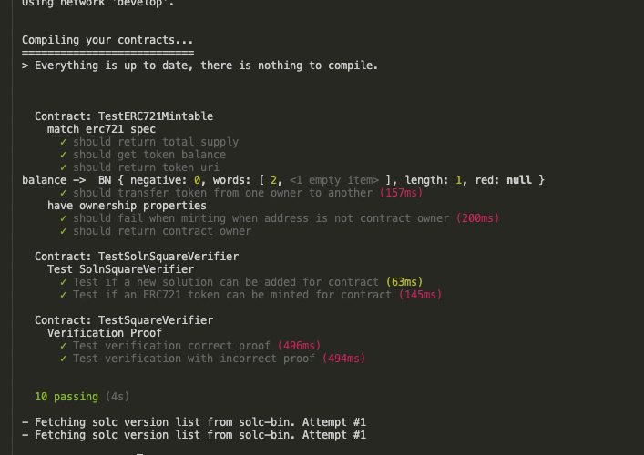
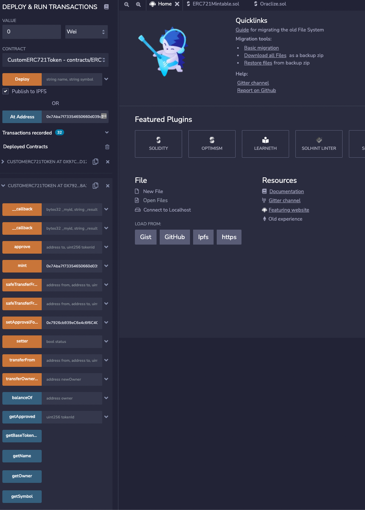

# Udacity Blockchain Capstone

The capstone will build upon the knowledge you have gained in the course in order to build a decentralized housing product. 

# Installation
1) `npm install`
2) `truffle compile`

---

## Getting Started with Zokrates

#### Resources
[Official ZoKrates](https://github.com/Zokrates/ZoKrates)

------
## installation

First run: `cd zokrates/code/` next follow all 7 steps.

1) `docker run -v  $(pwd):/home/zokrates/code --rm -ti zokrates/zokrates /bin/bash`
2) `cd zokrates compile -i square/square.code`
3) `~/zokrates setup`
4) `~/zokrates compute-witness -a 3 10`
6) `~/zokrates generate-proof`
7) `~/zokrates export-verifier`

### Troubleshooting: 
To run Zokrates on mac with m1: `docker run --platform linux/amd64 -v ${PROJECT_PATH}:/home/zokrates/code -it zokrates/zokrates /bin/bash`

----

# Local development / test
1) `truffle develop`
2) `truffle test`

# Rinkeby deployment
`truffle compile`
`truffle migrate --network="rinkeby"`

### Mint coin
This can be done with different tools, i used https://remix.ethereum.org/ , deployed contract and used actions mint(), Howevery, minint can be done with verifing rinkby contract as well.

### Etherscan
Verifier: https://rinkeby.etherscan.io/address/0xbd5B834429E30207f83D3D7f6E8f2ab5FE9371b0
SquareVerifier: https://rinkeby.etherscan.io/address/0x7926cb939eC6e4c6f6C4CdCf9e5F75152738A2a3

# OpenSea
https://testnets.opensea.io/collection/unidentified-contract-vbmyw0wtjs

# Project Resources

* [Remix - Solidity IDE](https://remix.ethereum.org/)
* [Visual Studio Code](https://code.visualstudio.com/)
* [Truffle Framework](https://truffleframework.com/)
* [Ganache - One Click Blockchain](https://truffleframework.com/ganache)
* [Open Zeppelin ](https://openzeppelin.org/)
* [Interactive zero knowledge 3-colorability demonstration](http://web.mit.edu/~ezyang/Public/graph/svg.html)
* [Docker](https://docs.docker.com/install/)
* [ZoKrates](https://github.com/Zokrates/ZoKrates)
